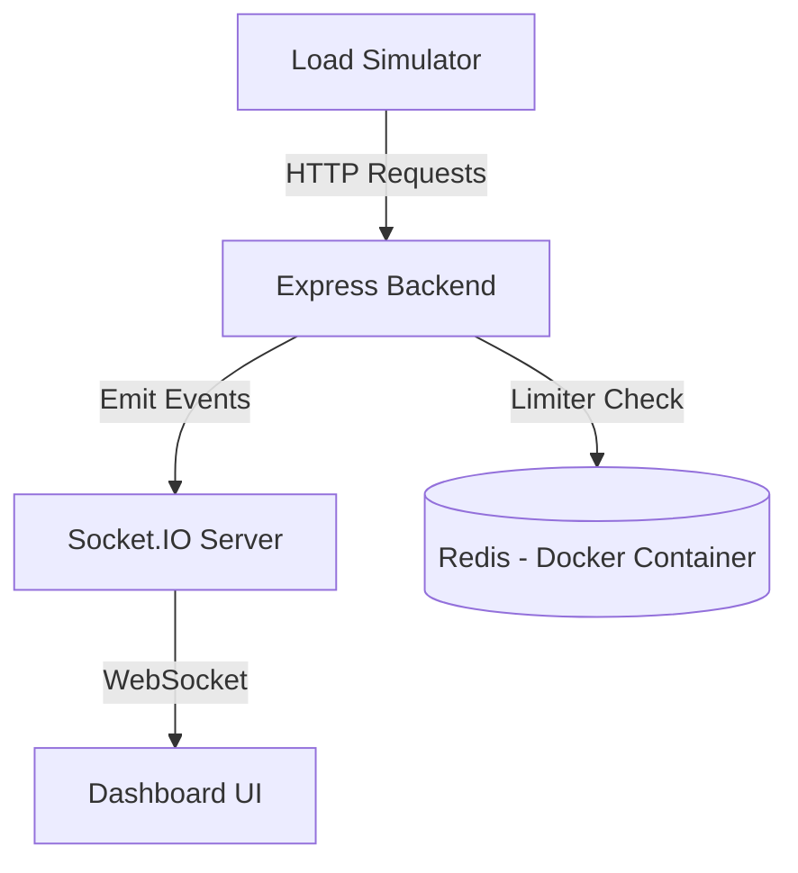
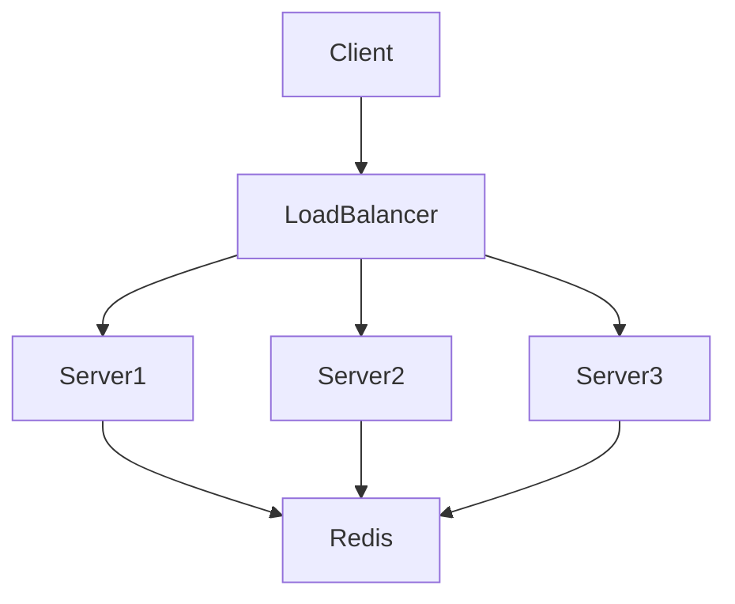

# System Design : Distributed Rate Limiter


A production-grade distributed API rate limiting system built using **Node.js, Express, Redis (Docker), Socket.IO, and React**, featuring a real-time load simulator and monitoring dashboard.

This project demonstrates how modern backend systems enforce rate limiting in distributed environments using Redis as a centralized limiter store, while providing real-time observability of limiter behavior under load.

This repository serves as:

• A production-ready Redis-based rate limiter implementation
• A real-time load simulator for stress testing limiter performance
• A reference architecture for distributed backend systems
• A teaching resource for understanding rate limiting internals

# Table of Contents

- [Overview](#overview)
- [System Architecture](#system-architecture)
- [Distributed Limiter Architecture](#distributed-limiter-architecture)
- [Technology Stack](#technology-stack)
- [Redis Limiter Internals](#redis-limiter-internals)
- [Limiter Key Design](#limiter-key-design)
- [Rate Limiting Algorithms Implemented](#rate-limiting-algorithms-implemented)
  - [Token Bucket Algorithm](#token-bucket-algorithm)
  - [Fixed Window Algorithm](#fixed-window-algorithm)
  - [Sliding Window Algorithm](#sliding-window-algorithm)
- [System Components](#system-components)
- [Frontend Simulator](#frontend-simulator)
- [Backend Implementation](#backend-implementation)
- [Real-Time Monitoring](#real-time-monitoring)
- [Docker and Redis Setup](#docker-and-redis-setup)
- [Installation](#installation)
- [Running the System](#running-the-system)
- [API Endpoints](#api-endpoints)
- [Project Structure](#project-structure)
- [Request Lifecycle](#request-lifecycle)
- [Horizontal Scaling Support](#horizontal-scaling-support)
- [Production Considerations](#production-considerations)
- [Use Cases](#use-cases)
- [License](#license)

# Overview

Rate limiting is a critical mechanism used by backend systems to protect APIs from:

• Abuse
• Denial-of-Service attacks
• Excessive traffic
• Resource exhaustion
• Credential brute-forcing

This system implements a distributed rate limiter using Redis, allowing multiple backend instances to share limiter state consistently.

Key features:

• Distributed limiter using Redis
• Multiple rate limiting algorithms
• Real-time request monitoring
• Load simulator capable of generating thousands of requests
• WebSocket-based live limiter state visualization
• Redis running inside Docker container

# System Architecture

High-level architecture:



# Distributed Limiter Architecture

This system uses Redis as a centralized limiter store.

Without Redis:

Each backend instance maintains its own limiter state → inconsistent enforcement.

With Redis:

All backend instances share limiter state → consistent enforcement.

Example distributed deployment:



Redis ensures:

• Consistent limiter state
• Cross-server synchronization
• Horizontal scalability
• High performance

# Technology Stack

Backend:

• Node.js
• Express.js
• Redis
• Socket.IO

Frontend:

• React
• Vite
• Tailwind CSS

Infrastructure:

• Docker
• Docker Compose

# Redis Limiter Internals

Redis stores limiter state using keys.

Example key:

```
rate_limit:ip:192.168.1.10
```

Stored data includes:

• Remaining request points
• Reset timestamp
• Block duration

Redis is ideal because it provides:

• In-memory performance
• Atomic operations
• Persistence support
• High concurrency handling

Limiter operations execute in O(1) time.

# Limiter Key Design

Limiter keys determine limiter scope.

Examples:

Per IP limiting:

```
rate_limit:ip:<ip_address>
```

Per user limiting:

```
rate_limit:user:<user_id>
```

Per route limiting:

```
rate_limit:route:<endpoint>
```

Combined limiter:

```
rate_limit:user:<user_id>:route:<endpoint>
```

This system can be easily extended to support all scopes.

# Rate Limiting Algorithms Implemented

## Token Bucket Algorithm

Concept:

Each client has a token bucket.

• Each request consumes one token
• Tokens refill at fixed intervals

Example:

• Capacity: 100 tokens
• Refill rate: 10 tokens per second

Advantages:

• Allows burst traffic
• Smooth rate control
• Production standard

Redis handles token tracking and refill timing.

## Fixed Window Algorithm

Limits requests within fixed time windows.

Example:

100 requests per minute.

Disadvantage:

Allows burst at window boundaries.

## Sliding Window Algorithm

Tracks requests continuously using timestamps.

Prevents burst abuse more effectively than fixed window.

Redis uses sorted sets internally.

# System Components

Backend Components:

• Express HTTP server
• Rate limiter middleware
• Redis client
• Socket.IO server
• Limiter service

Frontend Components:

• Load simulator
• Dashboard
• Metrics visualization
• Event log viewer

Infrastructure:

• Redis Docker container
• Docker Compose orchestration

# Frontend Simulator


The simulator generates configurable load against backend endpoints.

Capabilities:

• Configure requests per second
• Configure concurrency
• Configure total requests
• Select HTTP method
• View allowed vs blocked requests
• View real-time limiter metrics

Simulator tracks:

• Total requests
• Allowed requests
• Blocked requests
• Failed requests
• Average latency

Simulator uses asynchronous batching to simulate real client behavior.

# Backend Implementation

Limiter middleware intercepts incoming requests:

```js
const limiterMiddleware = async (req, res, next) => {
  try {
    await rateLimiter.consume(req.ip);

    next();

  } catch {

    res.status(429).json({
      error: "Too Many Requests"
    });

  }
};
```

Limiter workflow:

1. Request arrives
2. Middleware extracts client identifier
3. Redis checks available points
4. Redis atomically updates limiter state
5. Request allowed or rejected
6. Event emitted to monitoring dashboard

# Real-Time Monitoring


Socket.IO enables real-time monitoring.

Server emits limiter events:

```js
io.emit("rate-limit-event", {
  ip: req.ip,
  allowed: true,
  remaining: 42,
  timestamp: Date.now()
});
```

Frontend receives and updates dashboard instantly.

This enables real-time visualization of limiter behavior.

# Docker and Redis Setup

Redis runs inside Docker container managed by Docker Compose.

docker-compose.yml:

```yaml
version: "3.9"

services:

  redis:

    image: redis:7-alpine

    container_name: rate-limiter-redis

    ports:
      - "6379:6379"

    restart: always

    volumes:
      - redis-data:/data

    command: redis-server --appendonly yes

volumes:
  redis-data:
```

Start Redis container:

```bash
docker compose up -d
```

Verify Redis is running:

```bash
docker ps
```

Expected output:

```
rate-limiter-redis
```

Redis persists data using Docker volume.

# Installation

Clone repository:

```bash
git clone <repository-url>

cd api-rate-limiters
```

Install backend dependencies:

```bash
cd server

pnpm install
```

Install frontend dependencies:

```bash
cd client

pnpm install
```

# Running the System

Start Redis container:

```bash
docker compose up -d
```

Start backend server:

```bash
cd server

pnpm run dev
```

Start frontend:

```bash
cd client

pnpm run dev
```

Access dashboard:

```
http://localhost:5173
```

# API Endpoints

Health endpoint:

```
GET /health
```

Test endpoint:

```
GET /api/test
```

Rate limit status endpoint:

```
GET /api/rate-limit/status
```

# Project Structure

```
client/

  src/
    components/
    pages/
    services/
    store/

server/

  middlewares/
    rateLimiter.js

  services/
    redisClient.js

  routes/
    apiRoutes.js

  configs/
    redisConfig.js
```

# Request Lifecycle

Complete request lifecycle:

1. Client sends request
2. Express receives request
3. Limiter middleware executes
4. Redis validates limiter state
5. Redis updates request count
6. Request allowed or rejected
7. Socket.IO emits limiter event
8. Dashboard updates in real time

# Horizontal Scaling Support

This architecture supports horizontal scaling.

Multiple backend servers can share limiter state through Redis.

Compatible with:

• Load balancers
• Kubernetes
• Container clusters

Redis acts as centralized limiter authority.

# Production Considerations

Recommended improvements:

Use Redis Cluster for high availability

Deploy backend using Docker containers

Add authentication-based limiter

Add user-level limiter

Add route-specific limiter

Add admin monitoring dashboard

Add limiter analytics storage

Add failover handling

# Use Cases

API protection
Authentication protection
Public API infrastructure
SaaS backend systems
Microservices architectures
Distributed backend systems

# License

ISC License
